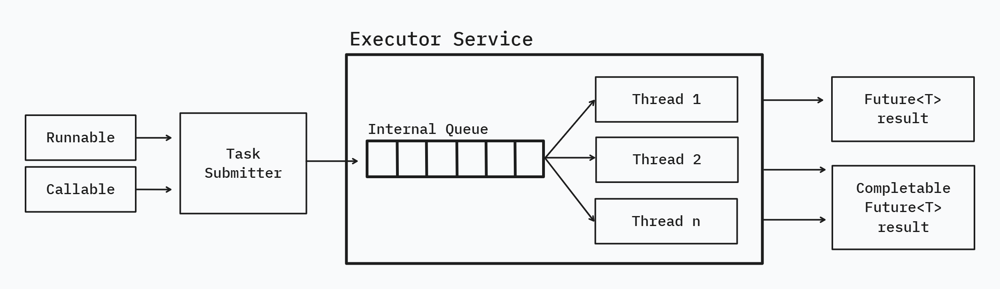

# Asynchronous Programming in Java

**What is asynchronous (async)?**

Start a task and continue doing other work without waiting for the task to finish. When the task is completed, you can
get notify or check when needed.

In simple words,

- Synchronous: Wait for it
- Asynchronous: Don't wait for it (happens in background).

### Main players in Java Async Architecture

**Task**

- The unit of work you want to run asynchronously.
- `Runnable` (no return) or `Callable<T>` (returns a value).

**Executor / ThreadPoolExecutor**

- Manages a fixed set of worker threads.
- Holds an internal queue for tasks that can't run immediately.
- Reuses threads instead of creating/destroying them every time.

**Worker Threads**

- The actual physical background threads that executes your tasks.

**Future / CompletableFuture**

- A placeholder that holds the result when the task gets completed.

### Execution Flow

1. Create an `ExecutorService`.
2. Submit tasks to the `ExecutorService` using `submit()` method
3. Worker Thread will pick these tasks from Executor Service and do the work in background.
4. Once the work is completed by the worker threads, it returns a `Future` / `CompletableFuture` which holds the result.

**Read Also**
- [Threads in Java](threads-java.md)