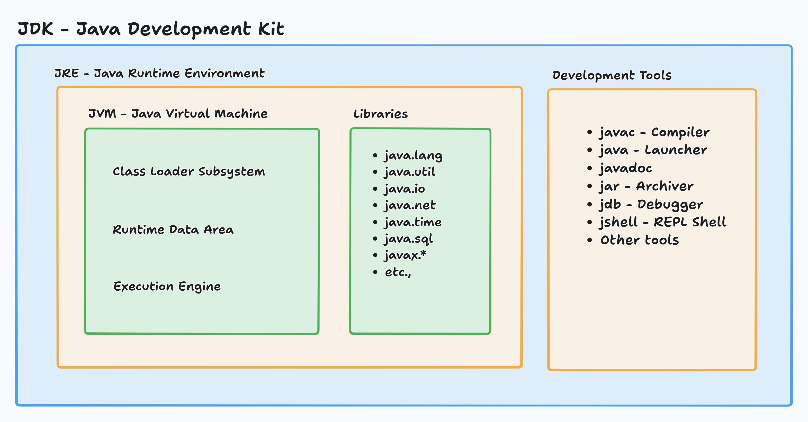

# Java Architecture



Consider a simple java program

```java
// Main.java
class Main {
    public static void main() {
        System.out.println("Hello World");
    }
}
```

### Steps of Execution

1. Compilation using `javac`

   `javac Main.java`

    - The source code `Main.java` is compiled to `Main.class` using `javac`
    - During the compilation process, the compiler checks for
        - syntax error
        - verify language rules
        - generates bytecode (`Main.class`)

   This bytecode is platform independent, non human-readable, understood by JVM.

2. Run the program using `java`

   `java Main`

   - Using Launcher (from Development Tools), the application / program strats.
   - Alongside JVM is also started to execute the code.

3. Inside JRE
    
   - **Class Loading** - The Class Loader Subsystem looks form `Main.class` in classpath and loads the bytecode into 
   JVM memory.
   - **Bytecode Verification** - The bytecode verifier checks for illegal instructions, memory corruption & type safety 
   access control and prevents form running if any present.
   - **Class Linking & Initialization** 
     - Class & methods linking.
     - Initializes static variables.
     - Runs static blocks.
   - **Execution Begins** - JVM looks for `main` method and calls it as entry point.
   - **Bytecode Interpretation** - JVM interprets the bytecode instructions line by line. (This process is a bit slower)

### Runtime Data Area in JVM

- Inside JVM few memory areas are created to execute the program

  - Method Area 
    - Stores class-level data, static variables & String pool constants.
    - Shared across threads.
  - Heap Memory
    - Shared across threads.
    - Stores objects and instance variables.
    - Managed by Garbage Collector.
  - Java Stack
    - Each thread has its own stack.
    - Local variables are stored here.
    - Method calls are stacked here.
  - PC Registers
    - Each thread has its own
    - Holds the address of instructions to execute in JVM in order.
  - Native Method Stack
    - Used when native methods are called via JNI (Java Native Interface).
    - Native calls information are stored here.

### Execution Engine in JVM

- Interpreter - The Bytecode Interpretation happens in the Interpreter.
- The JIT Compiler (Just In Time) looks for methods that are executed often (loop) and compiles them into native 
machine code (CPU Instructions).
- Garbage Collector (GC) - When objects in heap are not referenced by any variable, they are automatically removed. JVM 
decides when to run the GC, but a developer can perform some operations when GC hits.

### Native Libraries & Interfaces

- This allows calling C/C++ code from a java program.
- Native platform dependent libraries are called using this (.dll files in windows).