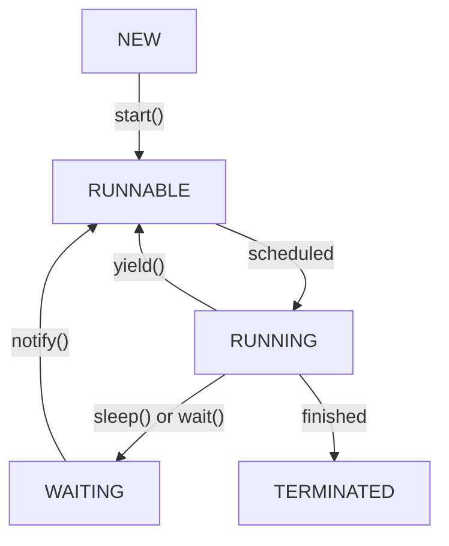

# Threads in Java

### What is thread?

A **thread** is the smallest unit of execution in a program.

- Each java app has at least one thread: the **main thread**.
- Threads share the same process memory but have their **own stack**.
- Multiple threads allow tasks to run concurrently.

### Creating a Thread

**1. Extending `Thread` class**

```java
class CustomThread extends Thread {

    @Override
    public void run() {
        System.out.println("Hello from " + Thread.currentThread().getName());
    }

}

class Main {
    public static void main(String[] args) {
        CustomThread t1 = new CustomThread();
        t1.start();
    }
}
```

**2. Implementing `Runnable` interface**

Note: Runnable is a functional interface.

```java
class Main {
    public static void main(String[] args) {
        Runnable task = () -> System.out.println("Hello from task in Runnable");
        Thread t = new Thread(task);
        t.start();
    }
}
```

### Lifecycle of Thread



| State      | Description                                                                                                      |
|------------|------------------------------------------------------------------------------------------------------------------|
| NEW        | A new `Thread` object is created but not yet started                                                             |
| RUNNABLE   | Thread is ready to run, waiting for the OS scheduler to pick and run                                             |
| RUNNING    | The task is being executed but the worker thread                                                                 |
| WAITING    | The thread has paused its execution either for a limited time or waiting for some signal to resume its execution |
| TERMINATED | The thread has completed its execution.                                                                          |


### Threads Priority

Threads have priority from 1 to 10, based on which the program can suggest to the actual thread to pick and execute a 
particular task.

- 1 being the lowest priority
- 10 being the highest priority
- By default, when a thread gets initialized it 'll get priority as 5.

Key points:

- Threads are scheduled by JVM and OS, one cannot force the execution order.