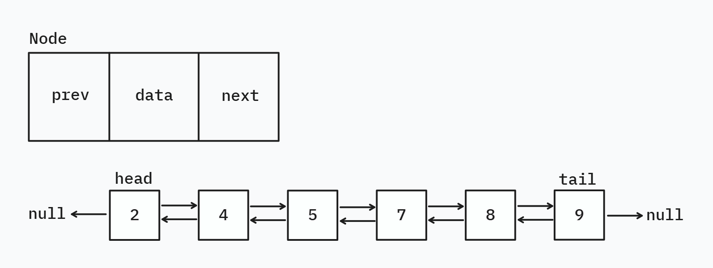

# Doubly LinkedList

A Doubly LinkedList is a linear data structure where each node contains:

- Data
- Pointer to next node
- Pointer to previous node.

This allows traversal in both the direction.

**Comparison - Singly vs Doubly-Ended Linked List**

| Feature                                   | Singly                        | Doubly-Ended                                              |
|-------------------------------------------|-------------------------------|-----------------------------------------------------------|
| Links per node                            | 1 (next)                      | 2 (prev and next)                                         |
| Traversal direction                       | forward                       | forward and backward                                      |
| Memory usage                              | Less (1 pointer per node)     | More (2 pointers per node)                                |
| Insertion/Deletion at tail                | Slower without tail reference | Faster with direct tail reference                         |
| Complexity of insertion/removal in middle | O(n) (needs forward search)   | O(n) but can be optimized by traversing from head or tail |

### Operations implemented in [DoublyLinkedList](DoublyLinkedList.java)

**Insertion**

- `addFirst(int data)` — Insert at the beginning 
- `addLast(int data)` — Insert at the end 
- `insertAt(int index, int data)` — Insert at a specific index (optimized by traversing from head or tail based on index)

**Removal**

- `removeFirst()` — Remove head node
- `removeLast()` — Remove tail node
- `removeAt(int index)` — Remove element at a specific index
- `remove(int data)` — Remove first occurrence of a given value

**Access & Search**

- `get(int index)` — Retrieve element at index
- `set(int index, int data)` — Update element at index
- `contains(int data)` — Check if element exists
- `indexOf(int data)` — Get first occurrence index
- `lastIndexOf(int data)` — Get last occurrence index (optimized with backward traversal)

**Utility**

- `size()` — Number of elements
- `isEmpty()` — Whether the list is empty
- `clear()` — Remove all elements
- `toString()` — String representation from head to tail

> Checkout [`Main.java`](Main.java) for an example demonstration.