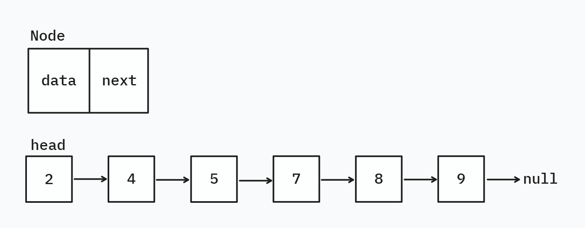

# Single LinkedList

A LinkedList is a linear data structure where elements (nodes) are connected using pointers.

Unlink Arrays:

- **Dynamic Size**: can grow or shrink without reallocation.
- **Efficient Operations**: few operations like insertion / removal at beginning and middle are efficient compared to
  array. With tail pointer insertion at end is also efficient.

However:

- **Slow Random Access**: retrieving an element at index `i` is O(n) as traversal is required.
- **Extra Memory Overhead**: Each node stores data **and** a reference to the next node.

### Operations implemented in [SinglyLinkedList](SinglyLinkedList.java)

**Insertion**

- `add(int data)` - Append to the end
- `addFirst(int data)` - Insert at the beginning
- `addLast(int data)` — Append to the end (alias for `add`)
- `insertAt(int index, int data)` — Insert at a specific index

**Removal**

- `remove()` — Remove the last element (alias for `removeLast`)
- `removeFirst()` — Remove the head element
- `removeLast()` — Remove the tail element
- `removeAt(int index)` — Remove element at a specific index
- `remove(int data)` — Remove the first occurrence of a given value

**Access & Search**

- `get(int index)` — Get element at index
- `set(int index, int data)` — Update element at index
- `contains(int data)` — Check if element exists
- `indexOf(int data)` — Get first occurrence index
- `lastIndexOf(int data)` — Get last occurrence index

**Utility**

- `size()` — Number of elements
- `isEmpty()` — Whether the list is empty
- `clear()` — Remove all elements
- `toString()` — String representation of the list

> Checkout [`Main.java`](Main.java) for an example demonstration.