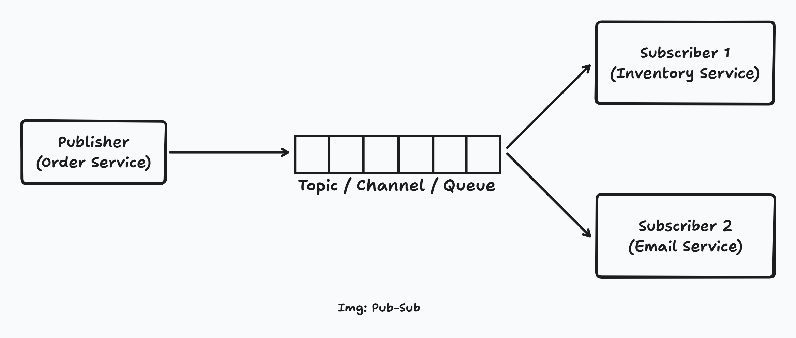
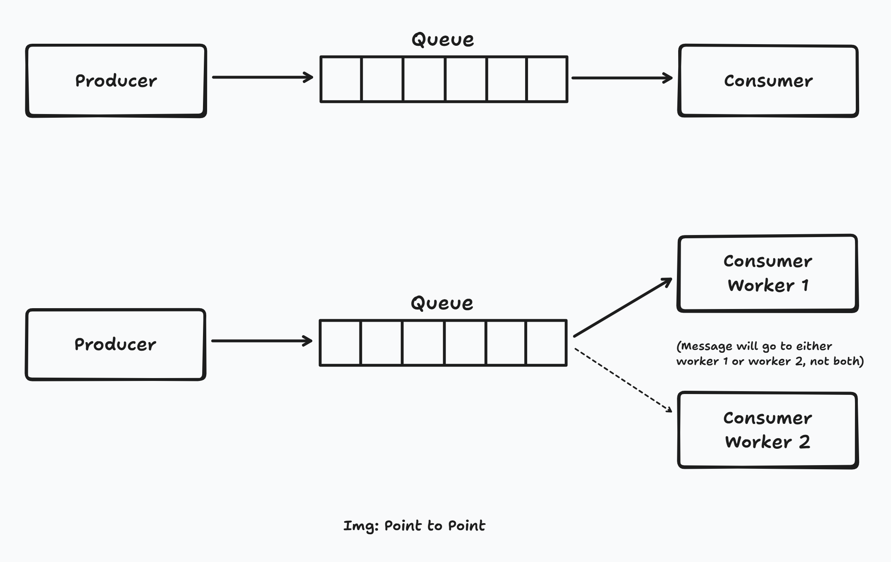
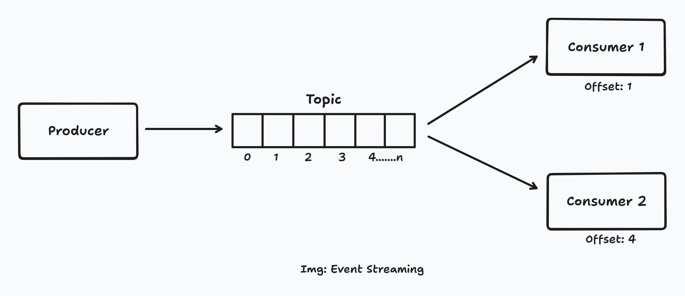

# Event Driven Architecture (EDA)

A **software design pattern** in which the flow of the system is determined by events. Event is a record for a change
of state or an action of something that happened. (e.g. "Order Placed", "Button Clicked")

Instead of services calling each other directly (request / response), they react to events as they happen.

### Traditional vs Event Driven

| Traditional Architecture (Request / Response)             | Event Driven Architecture                                 |
|-----------------------------------------------------------|-----------------------------------------------------------|
| A service calls another directly (e.g., REST API call).   | A service emits an event (“OrderPlaced”) to a broker.     |
| Tight coupling — both must be available at the same time. | Loose coupling — the event can be processed later.        |
| Synchronous communication (blocking).                     | Asynchronous (non-blocking).                              |
| Harder to scale and evolve independently.                 | Easy to add new consumers without touching existing code. |

### Example

Consider a user places an order in an e-commerce app.

**Traditional Approach**

1. User places an order.
2. The order is processed in the system.
3. An email sent to the user stating "Order Confirmed".
4. The user's UI screen updates as "✅ Order placed successfully".

**Problem**

Here the user's app will show order confirmed only after an email / sms has been sent to him, which need not happen
synchronously. That email / sms can reach the user in a later point of time, but the UI response should be
optimistically. What happens if something went wrong when an email is sent? Will the order be cancelled? How is this
problem solved?

**Event Driven Approach**

1. User places an order.
2. The order is processed in the system.
3. "Order Placed" event will be triggered to a queue / broker.
4. The user's UI screen updates as "✅ Order placed successfully".
5. In the background, the event is picked up and email / sms is sent to the user.

Here step 5 is an asynchronous process. **Asynchronous** means a process for which someone is not waiting for a
response immediately.

### Why do we need EDA?

1. **Loose Coupling**
    - Producers don’t need to know who consumes the event.
    - Consumers can be added or removed without modifying the producer.

2. **Scalability**
    - Since events are asynchronous, components can scale independently.
    - Message brokers (like Kafka) can handle millions of events/sec.

3. **Resilience**
    - If a consumer is down, the broker can hold events until it recovers.
    - Failures in one service don’t cascade.

4. **Asynchronous Processing**
    - Systems can handle long-running tasks in the background.
    - Improves responsiveness and throughput.

5. **Extensibility**
    - Add new event consumers (e.g., inventory, auditing, analytics) without touching existing systems.

### Terminologies

**Broker**

In general a broker is an intermediate / middleware between two parties. Here it sits between producer and a consumer.

**Topic / Channel**

A logical group of related events or messages.

**Producer**

Component responsible for emitting the event to the topic / queue.

**Consumer**

Component that listens and reacts to the events in the queue.

### Common Patterns in EDA

#### Publisher Subscriber Pattern (Pub-Sub)

In pub-sub, the publisher broadcasts a message to a channel (topic). Any number of consumers can subscribe to that
channel and receive a copy of the message. It's a **One-To-Many** communication pattern.

**Example:**

Consider the same e-commerce app.

1. Order Service publishes an event "Order Placed" - `{ "orderId": 101, "userId": "USR1010" }`
2. The event goes to 'orders' topic in the broker.
3. Multiple Services subscribe to the topic.
    - Inventory Service - reduces stock
    - Notification Service - sends confirmation email



#### Point to Point Pattern (Event Queue)

In this pattern, the producer sends message to a queue and a consumer will read and process the message. There can be
multiple consumer workers to scale horizontally and process messages parallelly, but they act as worker and only one of
them will consume the message. It's a **One-To-One** communication pattern.



The above two patterns are just pass through. Messages can be sent asynchronously from one system to another. Once
messages are consumed, they are done. They can be configured to store message, but cannot be replayed (re-consumed).
This problem is solved in the below pattern.

#### Event Streaming Pattern

It's a combination of Pub-Sub and Point to Point pattern, and additionally messages can be stored durably for future
consumption and can be replayed.

The messages are immutable, ordered and appended in sequence in chronological order with timestamp & offset details.

Each consumer keeps track of what they have consumed, and old messages can be replayed if needed.



**Pub-Sub vs Event Streaming Pattern**

| Aspect          | Pub-Sub                                                  | Event Streaming                                                   |
|-----------------|----------------------------------------------------------|-------------------------------------------------------------------|
| Core Purpose    | Real-time message delivery to one or more subscribers.   | Durable ordered record of events to consumers.                    |
| Event Lifetime  | Usually transient - Once consumed, they are gone.        | Persistent — events are stored for a defined retention period.    |
| Order Guarantee | No strict global order is maintained.                    | Strict order is maintained.                                       |
| Replayability   | Not possible (once consumed, gone).                      | Possible — consumers can replay from any offset.                  |
| Consumer State  | Broker doesn’t track which messages a consumer has seen. | Each consumer maintains an offset (where it left off in the log). |

#### Event Sourcing

A state management pattern, where the current state of the system is determined from a sequence of past events instead
of a database. All the messages are stored permanently. Events can be used as the source of truth to determine the
state of the system by this pattern.

**Example:**

Consider transactions made by a user in a bank account. The events will be like the following.

```text
{ "userId": "USR123", "transaction": "credit", "amount": 400 }
{ "userId": "USR123", "transaction": "debit", "amount": 100 }
{ "userId": "USR123", "transaction": "debit", "amount": 200 }
```

Now the current balance of the user will be determined based on transactions in his account

Current Balance = +400 - 100 - 200 = 100

#### Summary of Patterns

| Pattern         | Use-case                                                                            |
|-----------------|-------------------------------------------------------------------------------------|
| Pub-Sub         | When you need to broadcast events to multiple services (notifications, updates).    |
| Point-to-Point  | When you need task distribution or background processing.                           |
| Event Streaming | When you need durable, replayable event pipelines (analytics, telemetry).           |
| Event Sourcing  | When you need full auditability or reconstructable system state (finance, banking). |


#### Read Also

- [Kafka Architecture](kafka.md)