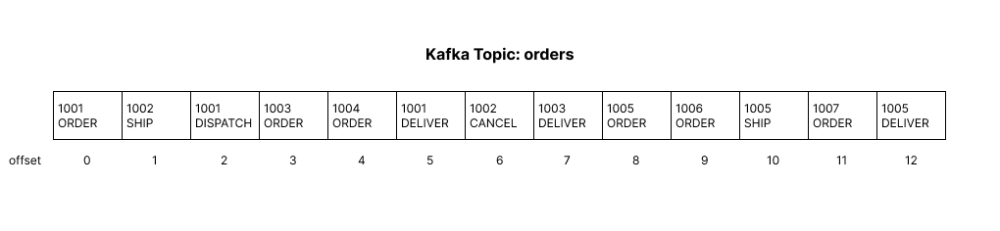
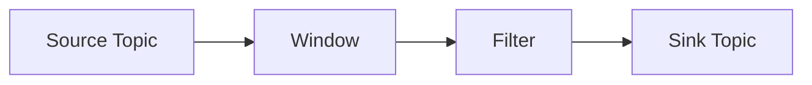

# Kafka Streams

Consider a kafka topic **orders** where every phase of an order in an e-commerce app is produced as a message. 
For example ORDERED, SHIPPED, DISPATCHED, DELIVERED, CANCELLED, etc., 

**Scenario**: Count the number of orders being placed every minute, for analytics purpose

| Time Window   | Orders Placed |
|---------------|---------------|
| 12:00 - 12:01 | 9 Orders      |
| 12:01 - 12:02 | 13 Orders     |
| 12:02 - 12:03 | 6 Orders      |

This can be done with a normal kafka consumer setup, but that would introduce complexity to the application
using threads, maintaining manual state, consuming the message and checking timestamp.

Kafka Streams can handle this easily with its inbuilt feature.

### Features of Kafka Streams

- **Window:** The above-mentioned scenario where the count of orders has to be tracked for every minute time window.
- **Filter:** In the same scenario where only newly placed order "status": "ORDERED" has to be tracked.
- **Group By:** Group the total revenue made in a particular window. Another analytics feature. Or maybe group the 
revenue made by each payment method like CREDIT_CARD, GIFT_CARD, CASH_ON_DELIVERY, etc.,
- **Join:** Just like SQL JOIN query, combining the details from multiple topics to a single view. (Rare use case)

### Stream Processing Topology

Consider it as a 
pipeline
where the messages (orders) flow from the source (topic) to the sink (destination) by going through multiple processing steps.
Each step is called as a **Node** 

**Source:** The topic from where data streams and it has to be filtered or grouped. Source Node should not have 
any upstream

**Sink:** The destination, it might be a topic or a table view after the data has been processed by multiple nodes.
Sink node should not have any downstream.

### References:
- [Apache Kafka Streams](https://kafka.apache.org/40/documentation/streams/core-concepts)