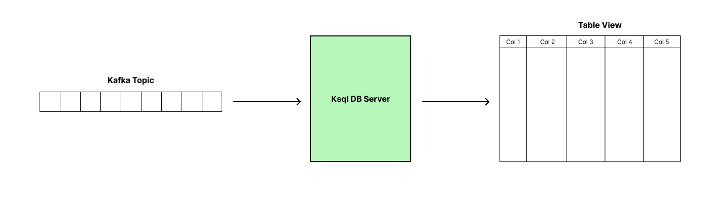

# KSQL Streams (KsqlDB)

> Prerequisites: Kafka Fundamentals and [Kafka Streams](README.md)

Now kafka is great, kafka streams is great. What is KSQL Streams? 

We have kafka streams which is a client side library 
or an API use to perform powerful streaming operations on the records / messages available in a kafka topic.

But building stream applications are not easy, it needs a learning curve ☹️. Instead, you can dive into KSQL directly 
from kafka for building streams easily. It is an abstraction on top of the kafka streams.

KSQL lets you create streams on the go with SQL queries using SELECT, CREATE, WHERE, etc.,



Consider the orders example which we have seen in kafka streams. Let's say you want to view the list of orders that 
are delivered. Sample dataset [here](sample-dataset.md)

**Step 1:** Create a STREAM
```sql
CREATE STREAM orders_stream (
    orderId STRING KEY,
    customer STRUCT<customerId STRING, name STRING, email STRING>,
    orderDate STRING,
    status STRING
) WITH ( KAFKA_TOPIC = 'ks-orders', VALUE_FORMAT = 'JSON' );
```

Now the KsqlDB server is like a database similar to sql server or a mongodb instance. The above query has to be 
executed in a shell inside the server. 

**Step 2:** Perform SELECT query to visualize data.
```sql
SELECT orderId, customer->name, orderDate, status FROM orders_stream WHERE status = 'DELIVERED';
```

Example Demonstration:


#### KsqlDB Server Local Setup

> You should have docker installed

**Steps:**
- Copy the contents of [this](ksql-streams-docker-compose.yml) file to `docker-compose.yml`
- Run `docker-compose up -d` from a bash / terminal.
- You should be able to access kafdrop UI from http://localhost:9000.
- Create a new topic and add few messages to the topic from kafdrop UI.
- Run `docker exec -it ksqldb bash` to get into the shell of the KsqlDB server.
- Run `ksql http://localhost:8088` to connect to ksql db.
- You will be seeing `>ksql`.
- Now get your hands dirty with KSQL CREATE, SELECT commands. 