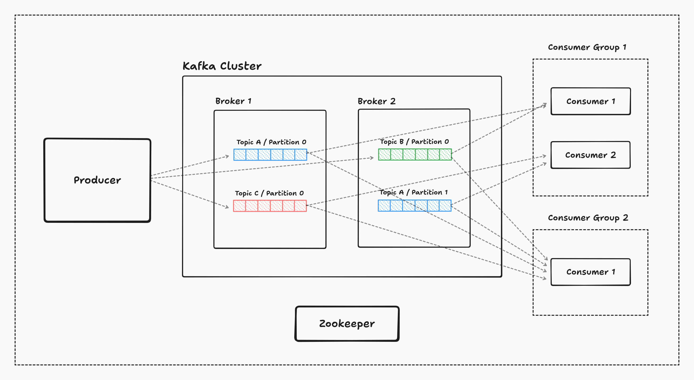
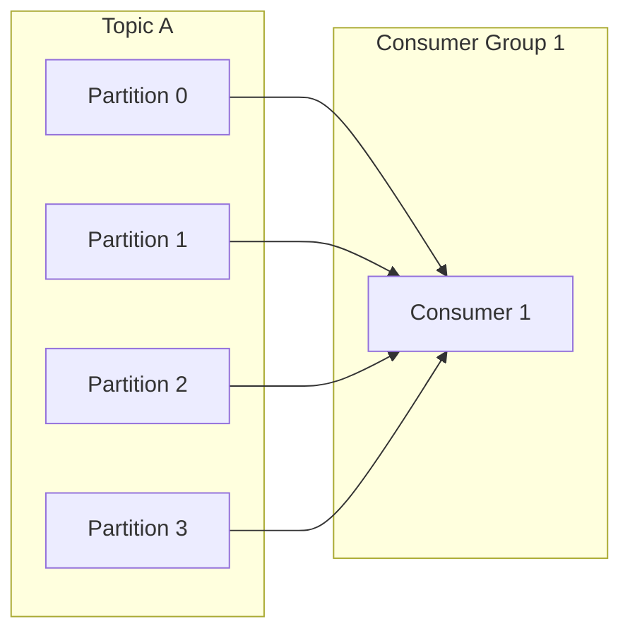
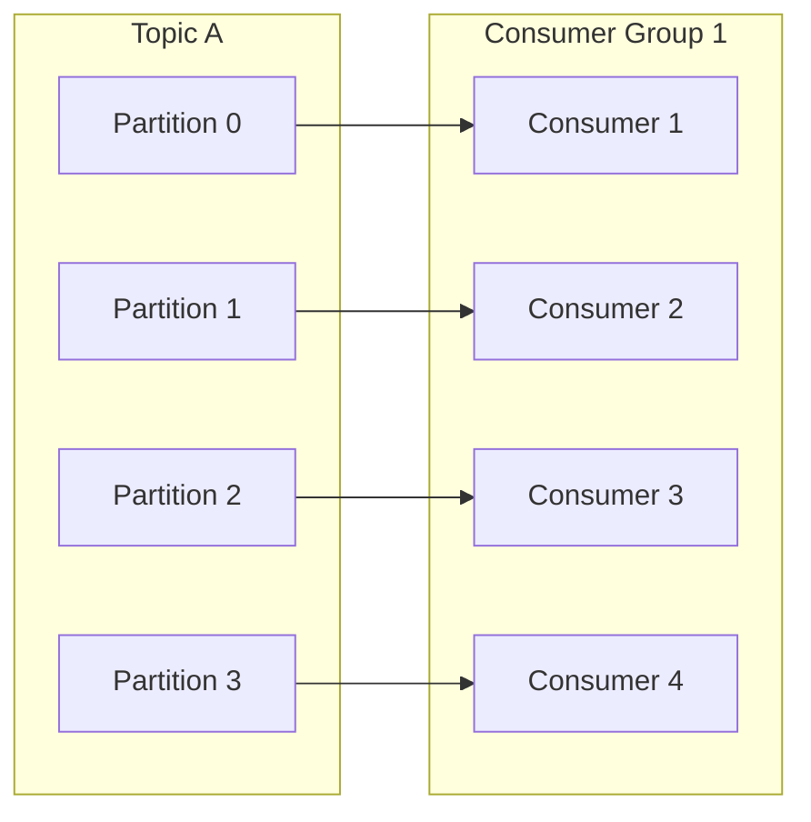
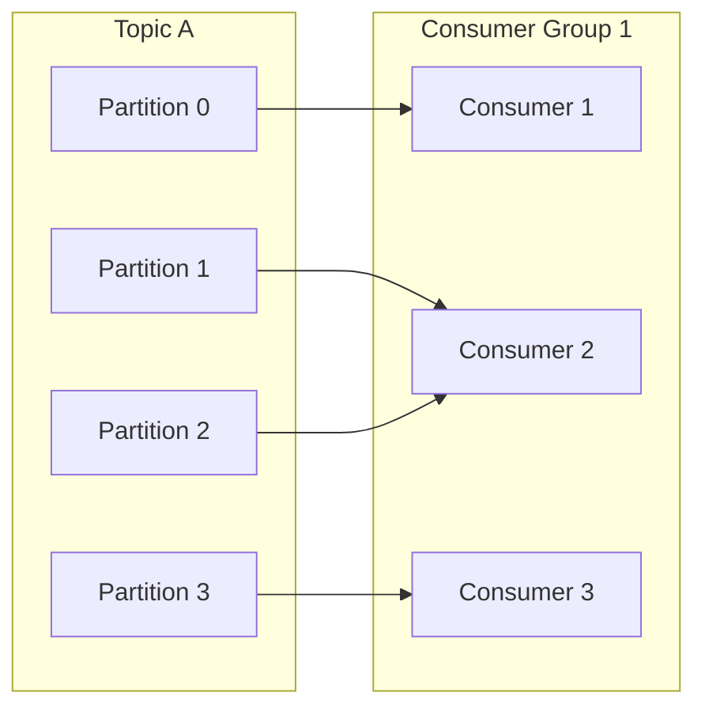
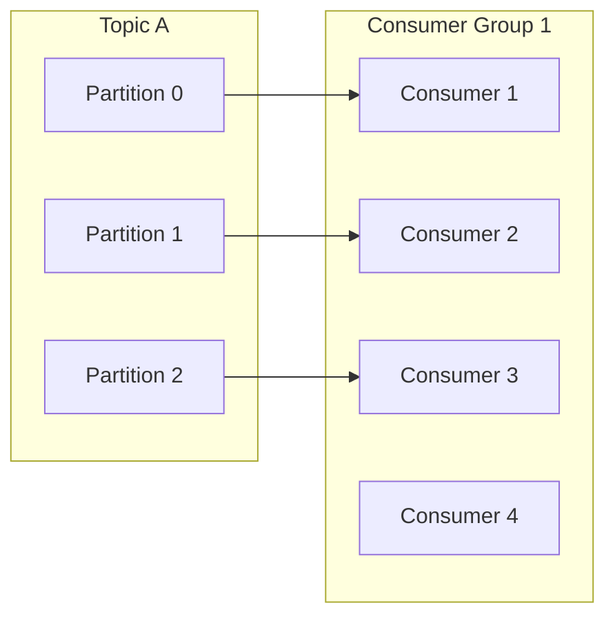
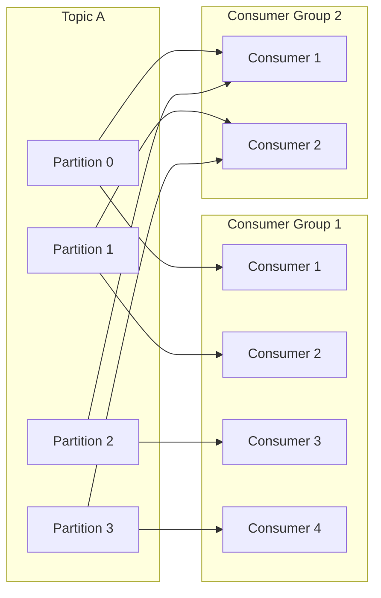

# Kafka

Apache Kafka is a distributed event-streaming platform that stores and transports ordered sequence of records at scale.
It organizes data in topics, runs on brokers and uses partition to provide parallelism.



**Table of Contents**
- [Terminologies](#terminologies)
  - [Topic](#topic)
  - [Broker](#broker)
  - [Partition](#partition)
  - [Log](#log)
  - [Producer](#producer)
  - [Consumer](#consumer)
  - [Consumer Group](#consumer-group)
  - [Partition - Consumer Group Scenarios](#partition---consumer-group-scenarios)

### Terminologies

#### Topic

A topic is a named category or feed to which records are published. It is a logical stream of events.

#### Broker

In general terms, a broker means an intermediate or a middleware between two parties. Here in kafka, it acts as a
server connecting producer and consumer.

#### Partition

- A subdivision of a topic, where each topic can have multiple partitions.
- A partition is an ordered, immutable sequence of records.
- Partitions allow parallelism (horizontal scaling) in kafka, where messages are distributed across partitions which
  can be processed parallelly.
- Each partition has its own log file on the disk and follows its own offset.

If a topic has more than one partition

- If the message which has a `null` key is posted to the topic, then the partition is selected in a Round Robin fashion.
- If the message has key, then kafka uses a formula to select the topic.

Note: Messages with same key will always be sent to the same partition.

```text
target_partition = hash(key) % no. of partitions
```

#### Log

Log is the fundamental storage unit in kafka. It is an append only file on the disk in a broker that stores events in
order for a given partition of a topic.

In the logs directory, each partition of a topic will have a dedicated directory like `test-topic-0` (Test Topic /
Partition 0), `test-topic-1` (Test Topic / Partition 1). In each partition directory, a `.log` file can be found like
`0000000000.log` or `0000000010.log`.

A log file is like a ledger where

- Every new record is appended at the end.
- Nothing is overwritten.
- Order is always preserved.

A new log file will be created once either the limit of `log.segment.bytes` or `log.segment.ms` is breached.

The existing log file will be deleted once the messages in that file exceeds the `log.retention.hours`.

#### Producer

A client that publishes record to a topic.

#### Consumer

A client that subscribes to topics and reads records.

#### Offset

A sequential id assigned to each record within a partition. Offsets identify the position of a record in the partition.
Offset is used to maintain the current position of the consumer.

#### Consumer Group

A consumer group is a set of consumers identified by a group id. They form a single logical unit.

- The group as a whole reads all the partitions of the topic it is subscribed to. The partitions are divided among the
  consumers in the group.
- At a given point of time, a partition of a topic can only be consumed by one consumer in a group.

This is the analogy.

- Partitions > Consumers - Some consumers will read multiple partitions.
- Consumers > Partitions - Some consumers will remain idle.

**Benefits**

- New consumers can be added to consumer group to increase scalability.
- If existing consumers are removed for some reason, existing partitions will be reassigned across other consumers in
  the group. (Fault Tolerance).

### Partition - Consumer Group Scenarios

### One Consumer Multiple Partitions



### Each Partition with its own consumer



### More Partitions than Consumers



### More Consumers than Partitions



### Multiple Consumer Groups



#### Read Also

- [Event Driven Architecture](eda.md)
- [Role of Zookeeper in Kafka](zookeeper.md)