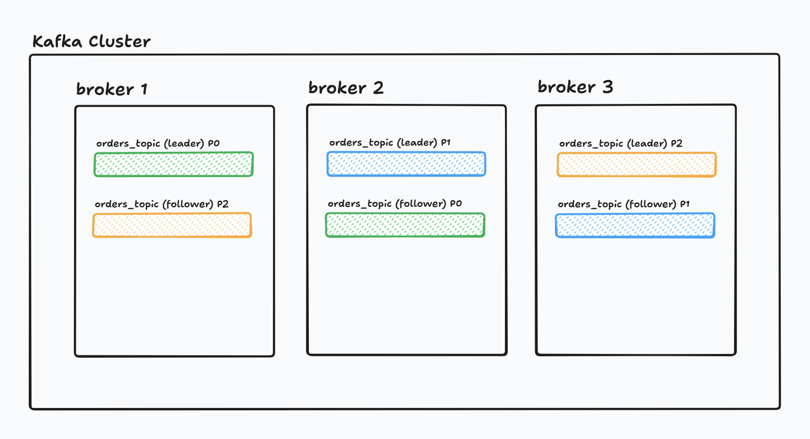

# Role of Zookeeper in Kafka

Kafka is not just a simple pub-sub system—it's a **distributed cluster of brokers**. A Kafka cluster can have multiple brokers, each identified by a unique `broker.id`.

> 💡 See [this](multi-broker-kafka-setup.yml) for a Docker-based multi-broker Kafka setup.

Assume we have three brokers: `broker1`, `broker2`, and `broker3`.

---

### Broker Registration and Discovery

When brokers start, they **register themselves with ZooKeeper**. Think of ZooKeeper as a **distributed metadata store and coordination service** for Kafka.

It maintains:
- A live list of brokers
- Their connection info
- Their ephemeral nodes (more on that below)

### Controller Election

Only **one broker** at a time acts as the **controller broker**. The controller manages:
- Partition leader elections
- Topic assignments
- Cluster metadata updates

ZooKeeper handles **controller election** using an **ephemeral znode**:
- The first broker that creates `/controller` becomes the controller.
- If that broker crashes, ZooKeeper deletes the node.
- The next available broker to create `/controller` becomes the new controller.

### Topic and Partition Metadata Management

Kafka topics are divided into **partitions**, and each partition can have multiple **replicas** for fault tolerance. These partitions and replicas are **spread across brokers**.

ZooKeeper stores:
- The partition-to-broker mappings
- Leader/follower assignments
- In-sync replica (ISR) lists

Example: Suppose you have a topic `orders_topic` with 3 partitions and 2 replicas.

Let’s say `broker2` fails:
- ZooKeeper removes its ephemeral node.
- `broker3`, which hosted a **follower of partition 1**, is promoted to leader.
- A **new follower replica** for partition 1 is created on `broker1`.
- A follower for partition 0 is also created on `broker3` to maintain replication.

All of this **metadata and leader election logic** is coordinated by the **controller broker**, but the **state is stored and watched through ZooKeeper**.

### Cluster Health & Monitoring

ZooKeeper uses **ephemeral znodes** to track active brokers and the controller:

- When a broker starts, it creates an ephemeral node like `/brokers/ids/1`.
- If the broker crashes or disconnects, the node is deleted.
- All other brokers are **immediately notified**.
- If the controller broker’s ephemeral node (`/controller`) disappears, a **new controller** is elected.

This mechanism ensures:
- Real-time failure detection
- Fast recovery and rebalancing
- Accurate leader/follower promotion

#### Read Also
- [Kafka Streams](kafka-streams/README.md)
- [KSQL Streams](kafka-streams/ksql-streams.md)
- [Replica Set in Mongo DB](../mongodb/replication-in-mongodb.md)