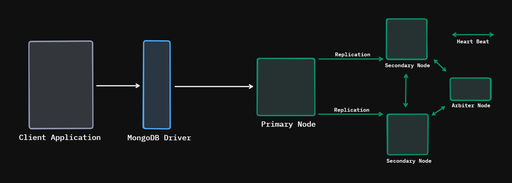

# Replication in Mongo DB

**Database Replication** refers to the process of copying and synchronizing data across multiple database servers to ensure high availability, fault tolerance, and load balancing.

> `mongod` is primary daemon process in Mongo DB

### Replica Set
- A group of Mongo DB instances (nodes) (multiple `mongod` processes) that maintain the same data set.
- Provides redundancy, high availability and automatic failover.
- Basis for all production deployments.

**Components of Replica Set**
- **Primary Node**
	- Receives all the write operations and read operations by default.
	- Maintains an operation log (oplog) to track changes.
	- Automatically elected in case of failure. ([Automatic Election](#automatic-election))
- **Secondary Node**
	- Synchronize data from the primary by oplog.
	- Can handle read operations if configured.
	- If Primary Node fails, an election process promotes one Secondary to Primary.
- **Arbiter Node (Optional)**
	- Does not store data, but participates in elections.
	- Helps in breaking ties when an election is needed.

### Automatic Election
1. **Primary Node Fails**
	- If the primary node fails and the secondary node detects this, they wait for a timeout period before starting the election.
2. **Election (voting process) Begins**
	- All the remaining data bearing (secondary) nodes starts voting for a new primary. 
	- A node that gets majority of votes to become the new Primary.
	- [Arbiter Node](#arbiter-node) comes into play here.
3. **New Primary is Elected**
	 - The new primary is elected based on
		 - Priority Settings
		 - Last known oplog position
		 - Most up-to-date data
		 - Voting Majority
	- The new Primary starts handling writes immediately.
4. **Old Primary Becomes a Secondary**
	- When the failed node comes back online, it automatically rejoins as a Secondary.

### Arbiter Node
- Arbiter Node is a special lightweight node in the Replica Set.
- It doesn't store any data. Stays idle. Monitors the Primary's health.
- Its main purpose is to participate in elections to help select a new Primary when needed.

**What is the need of Arbiter Node**
- MongoDB requires a majority of votes to elect a new Primary. If there’s an even number of nodes, a tie can occur, preventing a new Primary from being elected.
- Arbiters help break ties by adding an extra vote without needing additional storage or resources.
- They are useful in cost-sensitive deployments where adding a full Secondary node isn’t feasible.

### References
- [Chat GPT](https://chatgpt.com/share/67b1ca9f-0878-800d-85e5-34d65954162a)
- [Mongo DB Manual](https://www.mongodb.com/docs/manual/replication/)