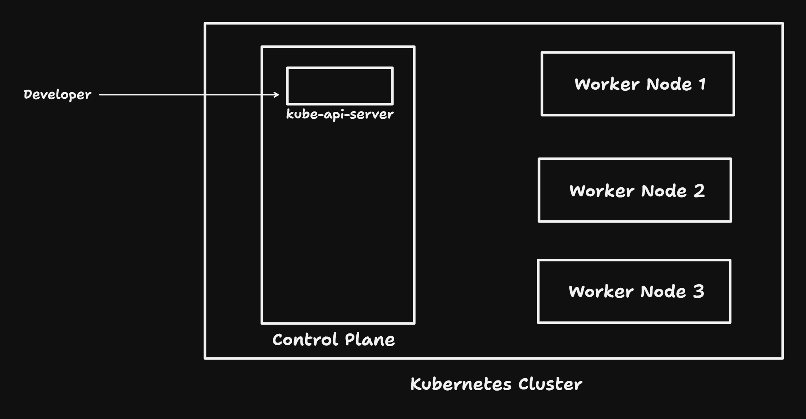
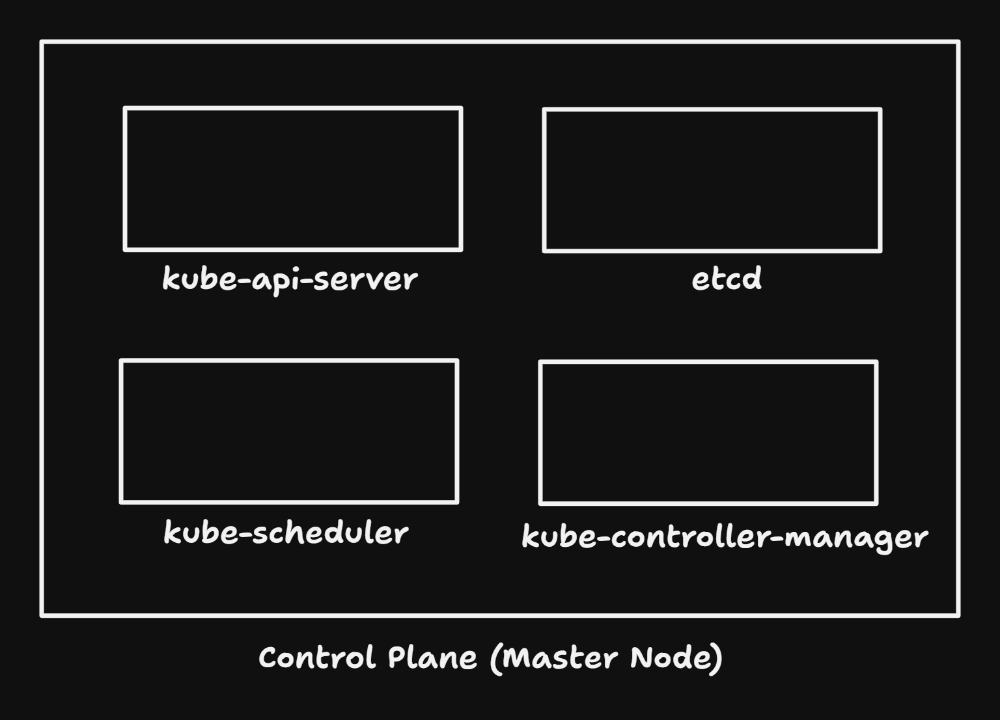
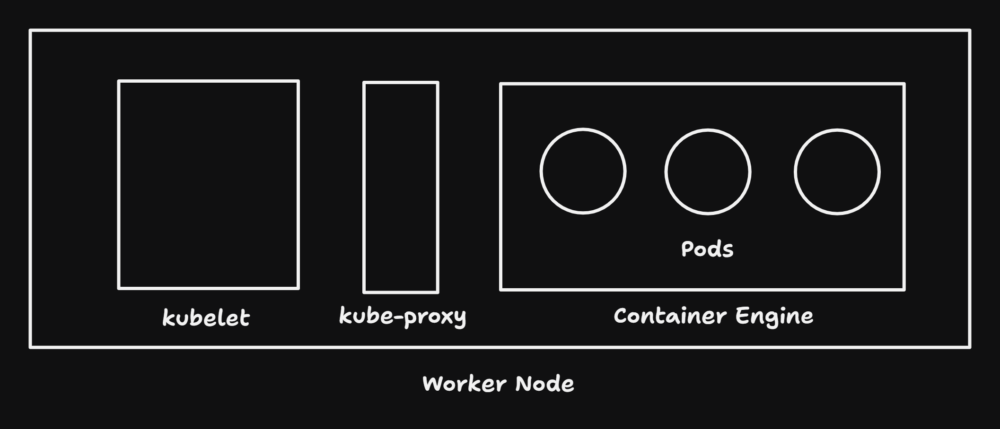
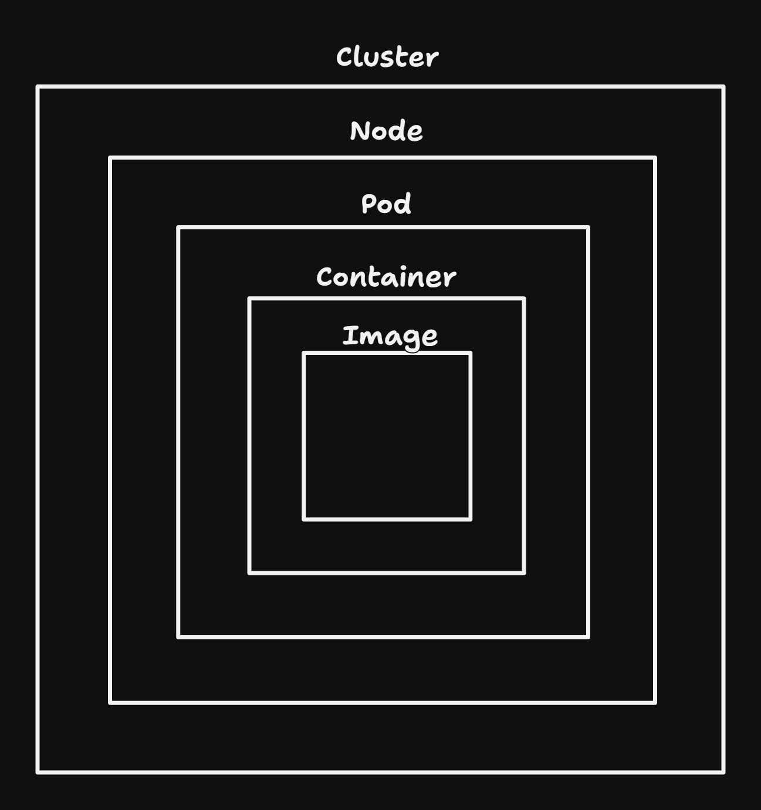

# Kubernetes Architecture

K8s follows a Master-Worker architecture. It consists of two components:

1. **Control Plane (Master Node)** - The brain of Kubernetes that manages the entire cluster.
2. **Worker Nodes** - The machines where applications (containers) actually run.



### Control Plane

Manages the cluster & ensures that the desired state of the application is maintained. It consists of:

1. **kube-api-server**
    - Acts as front door to kubernetes.
    - All the commands from the developer (via `kubectl` or UI) go through this API Server.
    - Other kubernetes components communicate through it.

2. **kube-controller-manager**
    - Manage controllers which automate tasks like restarting failed pods, scaling application, maintaining desired
      state, etc.,

3. **kube-scheduler**
    - Decides where to run a new container.
    - Allocates resources like CPU and memory.
    - Continuously watches for newly created pods with no assigned nodes and assigns a node for them to run on.

4. **etcd**
    - Distributed Key-Value store
    - Stores the entire Kubernetes cluster state.
    - Think of it as the database of Kubernetes.



### Worker Node

Each worker node runs the actual application containers. It has three main components:

1. **kubelet**
    - An agent running on each worker node that ensures containers are working as expected.
    - Communicates with the control plane.

2. **Container Runtime**
    - Responsible for running the actual containers.

3. Kube Proxy
    - Handles networking between containers.
    - Ensures communication between different services.



### How Kubernetes works together?

Lets say a new pod has to be created on one of the worker node. How does these components interact to create the pod.

1. **User sends a request**
    - A user or a system submits a request to create a pod using `kubectl` cmd or via HTTP.
    - The request is sent to `kube-api-server`, which is the entry point for the entire architecture.

2. **API Server Stores the Desired State**
    - The API Server validates the request and stores the desired state in etcd (Kubernetes Database).

3. **Scheduler Decides Where to Place the Pod**
    - `kube-scheduler` checks available worker nodes and selects the best one based on CPU, memory, and other
      constraints.

4. **API Server Notifies the Worker Node**
    - The API Server sends instructions to the Kubelet (agent running on the selected Worker Node).

5. **Kubelet Pulls the Container Image & Starts the Pod**
    - The `Kubelet` communicates with the Container Runtime (e.g., Docker, containerd) to pull the required container
      image and start the pod.

6. **Kubelet Reports Back to the API Server**
    - After successfully creating the pod, the Kubelet reports the pod status back to the API Server.

7. Kube Proxy Manages Networking
    - Kube Proxy ensures the new pod can communicate with other pods and services.

### Detailed Communication Paths

1. Control Plane to Worker Node Communication
    - The API Server communicates with Kubelet over a secured HTTPs connection.
    - The Scheduler does not talk directly to nodes; it only assigns the pod to a node.

2. Worker Node to Control Plane Communication
    - Kubelet constantly communicates with the API Server to fetch updates and report node health.
    - Metrics (CPU, memory) are sent to the API Server via metrics-server or prometheus.

3. Inter-Worker Node Communication
    - Kubernetes uses Kube Proxy for internal networking.
    - Pods can communicate using ClusterIP, NodePort, LoadBalancer, or Ingress.

### Pod

This word has been repeated a multiple times, but what is a pod? It is a **smallest deployable unit** in kubernetes. A
single instance of a running process in the cluster. Consider pods as wrappers around one or more containers (one in
most case).

**Manifest file for a single container pod**

```yaml
apiVersion: v1
kind: Pod
metadata:
  name: my-nginx
spec:
  containers:
    - name: nginx
      image: nginx

```

**Manifest file for Cluster (using kind)**

```yaml
kind: Cluster
apiVersion: kind.x-k8s.io/v1alpha4
nodes:
  - role: control-plane
  - role: worker
  - role: worker
```

```cmd
kind create cluster --config cluster.yaml
```

**Kubernetes Components Cluster to Node**



### Summary

- API Server sends instructions to Kubelet on Worker Nodes.
- Scheduler selects the best node for the new pod.
- Kubelet pulls the image and starts the pod.
- Kube Proxy manages networking.
- Kubelet reports status back to the API Server.
- Pod is the smallest unit in Kubernetes.

#### References

- [Kubernetes Components](https://kubernetes.io/docs/concepts/overview/components/)
- [Cluster Architecture](https://kubernetes.io/docs/concepts/architecture/)
- [Chat GPT](https://chatgpt.com/share/67bb341a-94a8-800e-b3f6-17fe5a70f12b)

#### Read Also

- [What is Kubernetes](./kubernetes-intro.md)
- [Replicaset in Mongo DB](../replication-in-mongodb.md)