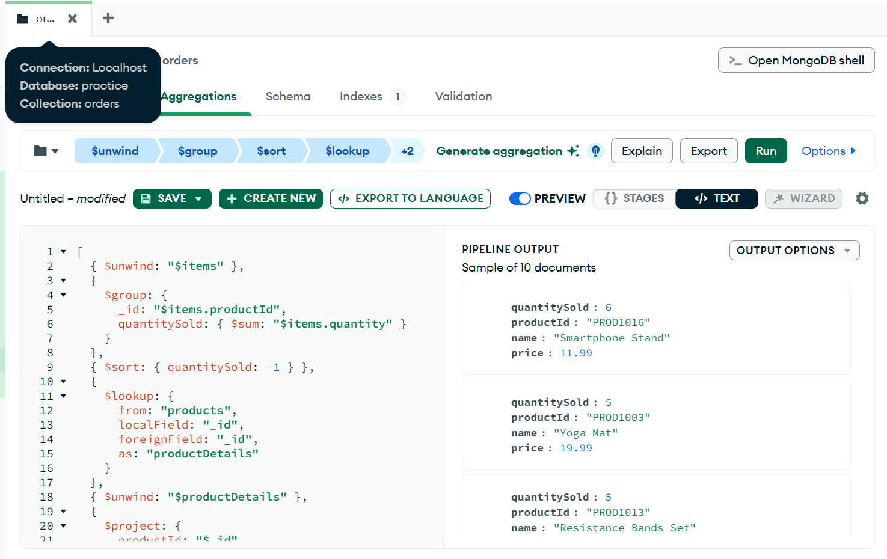

# Aggregation Pipelines in Mongo DB

**What is pipeline?**

In software, a pipeline is a **series of processing steps** where output of one step becomes the input of next.

**Aggregation Pipeline**

In Mongo DB we have query pipeline (Aggregation Framework) used to process and transform data. It is a **sequence of 
stages**, each stage transforming the documents as they pass through.

Each stage is an object like `{ $stageName: { ...options } }`.

**Example:**

**1) Orders per Customer**

```shell
db.orders.aggregate([
  {
    $group: {
      _id: "$customerId",
      orderCount: { $sum: 1 },
      totalSpent: { $sum: "$total" }
    }
  }
])
```

Returns something like:

```json
[
  {
    "_id": "CUST006",
    "orderCount": 2,
    "totalSpent": 147.64
  },
  {
    "_id": "CUST005",
    "orderCount": 3,
    "totalSpent": 225.63
  }
]
```

> 📘 Sample data used in this guide: [Dataset](./sample-dataset.md)

What it does?

`$group` is a stage in aggregation used to combine multiple documents.

`_id: "$customerId"` We are grouping all the orders (documents) having same customerId.

`orderCount: { $sum: 1 }` Adding a new field orderCount, that results to count of documents in each group.

`totalSpent: { $sum: "$total" }` Adding up the total field in all orders for each customer.

---

**2) Quantity sold per Product**

```shell
db.orders.aggregate([
  { $unwind: "$items" },
  {
    $group: {
      _id: "$items.productId",
      quantitySold: { $sum: "$items.quantity" }
    }
  },
  { $sort: { quantitySold: -1 } },
  {
    $lookup: {
      from: "products",
      localField: "_id",
      foreignField: "_id",
      as: "productDetails"
    }
  },
  { $unwind: "$productDetails" },
  {
    $project: {
      productId: "$_id",
      name: "$productDetails.name",
      price: "$productDetails.price",
      quantitySold: 1,
      _id: 0
    }
  }
])
```

Returns something like:

```json
[
  {
    "productId": "PROD1016",
    "name": "Smartphone Stand",
    "price": 11.99,
    "quantitySold": 6
  },
  {
    "productId": "PROD1003",
    "name": "Yoga Mat",
    "price": 19.99,
    "quantitySold": 5
  },
  {
    "productId": "PROD1013",
    "name": "Resistance Bands Set",
    "price": 24.99,
    "quantitySold": 5
  }
]
```



Explanation

Here we are doing multiple things, lets look it one by one

`$unwind`
- Flattens the items array so that each product in an order is treated as a separate document.
- For detailed explanation of unwind [see here](unwind-aggregation.md)

`$group`
- Groups by productId and calculates the total quantity sold for each product.

`$sort`
- Sorts products in descending order of quantity sold (most sold first).

`$lookup`
- Joins the grouped results with the products collection to fetch product details.
- For detailed explanation [see here](lookup-aggregation.md)

`$unwind`
- `$lookup` returns an array, we flatten it to a single product document.

`$project`
- Shapes the final output to include productId, name, price, and quantitySold, and hides MongoDB’s default _id.
- For detailed explanation [see here](project-aggregation.md)